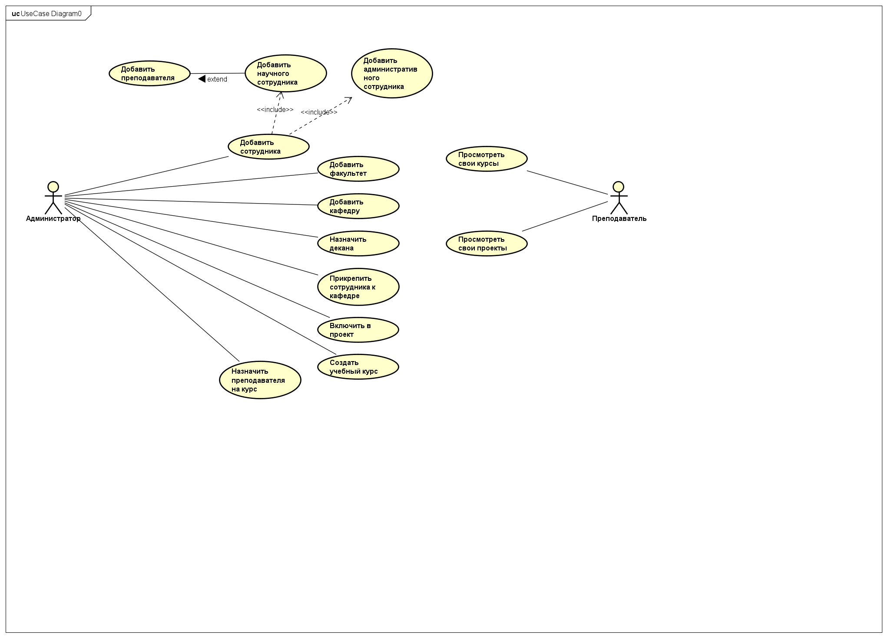
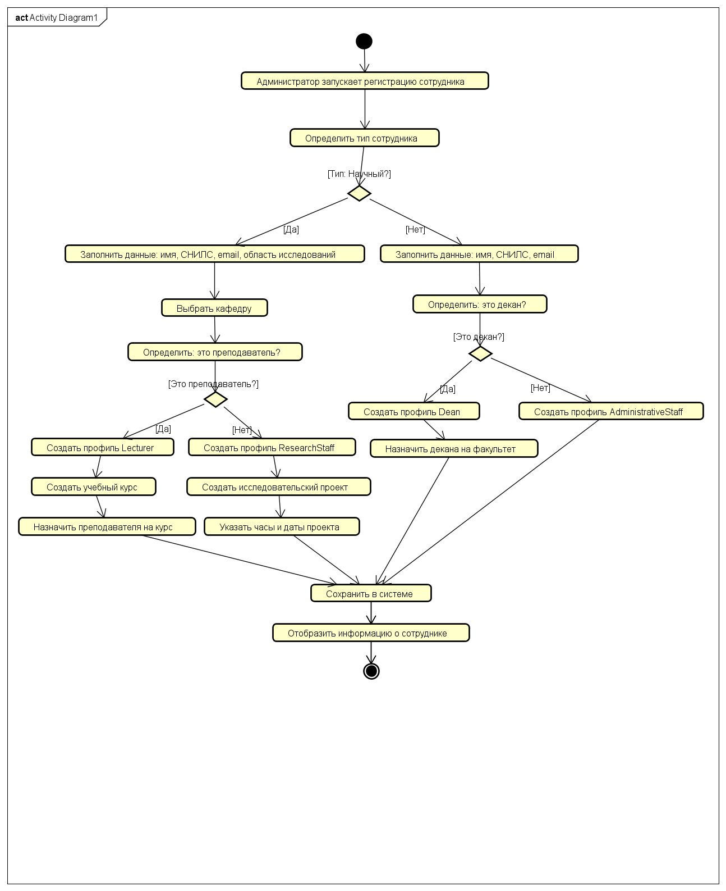
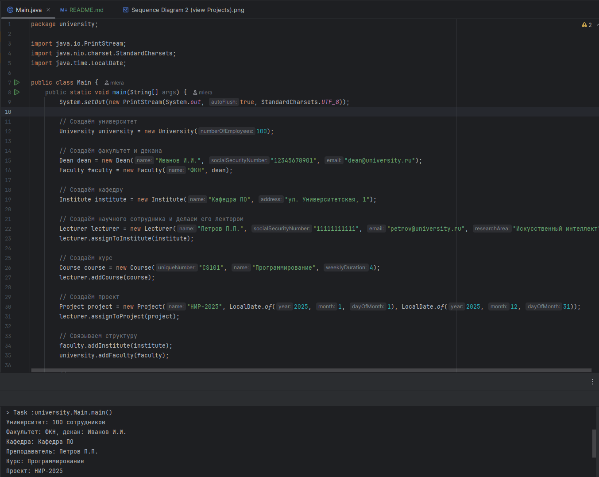

# Лабораторная работа №10: Университетская информационная система

---

## Цель работы

Разработать объектно-ориентированную модель университетской информационной системы на языке Java, реализовать её в виде кода, выполнить обратное проектирование (reverse engineering) в UML-диаграммы с помощью инструментов Astah/Visual Paradigm, и создать поведенческие диаграммы (прецедентов, последовательностей, активностей).

---

## Диаграмма классов

---

## Диаграмма прецедентов

---

## Диаграмма активностей

---
## Диаграммы последовательностей

### 1. Добавление преподавателя

.png)

---

### 2. Просмотр проектов сотрудника

.png)

---

## Работа программы

### Скриншот работы программы и её основных функций.

---
